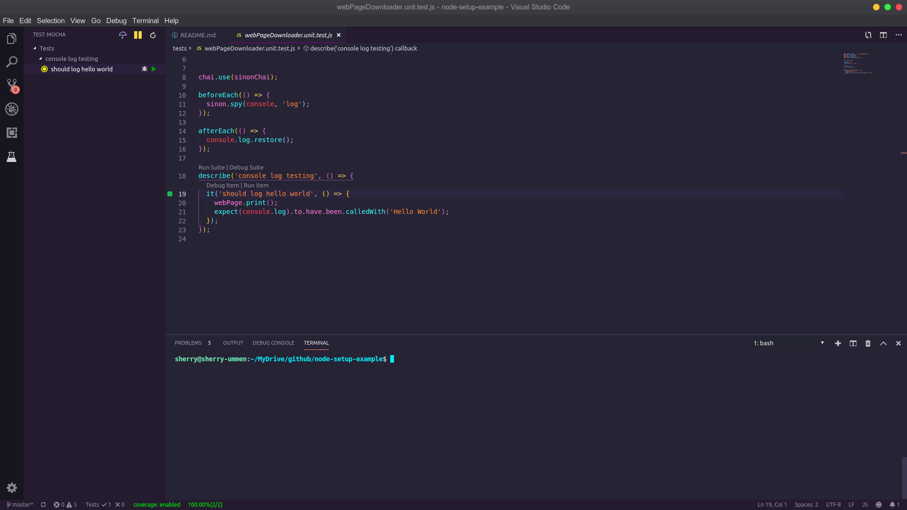

# VSCode settings needed to run NodeJS and Run tests

## VS Code extensions required

* npm
* npm intellisense
* bracket pair colorize 2
* eslint
* mocha
* import cost

> (Not necessary but if you like my editor style then)

* synthwave '84
* vs code icons (seti)

## Steps

* install latest version of nodejs

``` bash
sudo apt-get install curl software-properties-common &&
curl -sL https://deb.nodesource.com/setup_12.x | sudo -E bash - &&
sudo apt install -y nodejs
```

* *mkdir node-setup-example*
* *cd node-setup-example*
* *git init*
* *cd node-setup-example*
* *node init*
* fill out as you like, I filled like the snapshot given below

* *code .* (It will open visual studio code for current directory)
* folder stucture js/src
* create a file inside webDownloader.js
* add the code


``` javascript
function print(message){
console.log("Hello World")
}
```

* If you notice ESlint is not working because we have not installed ESlint.

* lets install it
* *npm install eslint --save-dev*
* *./node_modules/.bin/eslint --init*
* Now you can see eslint is working and giving us the list of problems, you can click on the bulb and find the fix or edit it by your experienc.

* Also I will disable jsdoc requirement, just to make things simple
* Now lets make the *npm start* command work, if you do it now by pressing F1 and type *npm start*, it will give error
   **npm ERR! missing script: start**
* Create a file index.js on the root folder level
* Edit webpageDownloader.js to add
  
```Javascript
module.exports = {
  print,
};
```

* open index.js and add these lines

```javascript
const webPage = require('./js/src/webPageDownloader');
webPage.print();
```

* open package.json file
* add this line under scripts key

```json
"start": "node index.js"
```

* Mine looks something like this


* Now lets run *npm start*, so press F1 and type *npm start*, you should get the code run and display something like this (see the below terminal of the vscode)


* Now we have done a lot so lets commit these changes
* I am using git and I have added **node_modules** folder to the .gitignore file.
* Now lets add unit testing for the print function we have
* For this we need mocha, chai, sinon, sinon-chai, so lets install it
* *npm install mocha --save-dev*
* *npm install chai --save-dev*
* *npm install sinon --save-dev*
* *npm install sinon-chai --save-dev*
* Lets add a folder called **tests** at the root level and then create a file **webPageDownloader.unit.test.js**
* Add the content of the file as

```javascript
const webPage = require('../js/src/webPageDownloader');
const chai = require('chai');
const expect = chai.expect;
const sinon = require('sinon');
const sinonChai = require('sinon-chai');


chai.use(sinonChai);

beforeEach(() => {
  sinon.spy(console, 'log');
});

afterEach(() => {
  console.log.restore();
});

describe('console log testing', () => {
  it('should log hello world', () => {
    webPage.print();
    expect(console.log).to.have.been.calledWith('Hello World');
  });
});
```

  > You can read more about unit testing nodejs app if you google about it, its beyond the scope of this article.

* Edit package.json to add the test command
* "test": "./node_modules/.bin/mocha 'tests/*.test.js'",
* It should look like something like this

* now press F1 and type *npm run test*
* You should see your test executed and pass, like this

* lets get our mocha side bar (vscode extension) working so that we can run individual test or set from VSCode.
* for mocha sider bar to discover our test files, we need to tell where to find the files. Go to VSCode File -> Preferences -> Settings
* Under Extensions find Mocha options and then change Mocha>Files : Glob to ***tests/*.test.js***
* Now select the Mocha sider bar icon which shoudl open a side bar pane, and click on refresh button which should list your unit test, select the test you want to run and click on the green button to execute the test.

* If the test run successfully then you should see the test will have a green cicrlce beside it meaning it passes, you can try failign the test as well.
* Its time to commit the changes
* Now lets enable the code coverage, for that we would need another npm package istanbul. Lets install it
*npm install istanbul --save-dev*
* Also you would need to install nyc for the mocha side bar to work correctly
*npm install nyc --save-dev*
* After this all you have to is click on the umbrella icon on the mocha side bar and it will generate a nice report and also if you go to the webPageDownloader.js file you will see yellow like on the lines covered.

*And at the bottom of vscode (status bar), you will the coverage percentage.

* And the html report looks like this

* Do not forget to put coverage and .nyc_output folder in .gitignore.

## Conclusion

* We say how to setup our IDE to look beautify
* We installed NoideJS and other required packages
* We wrote a small picece of code
* Added unit test
* Generated code coverage
