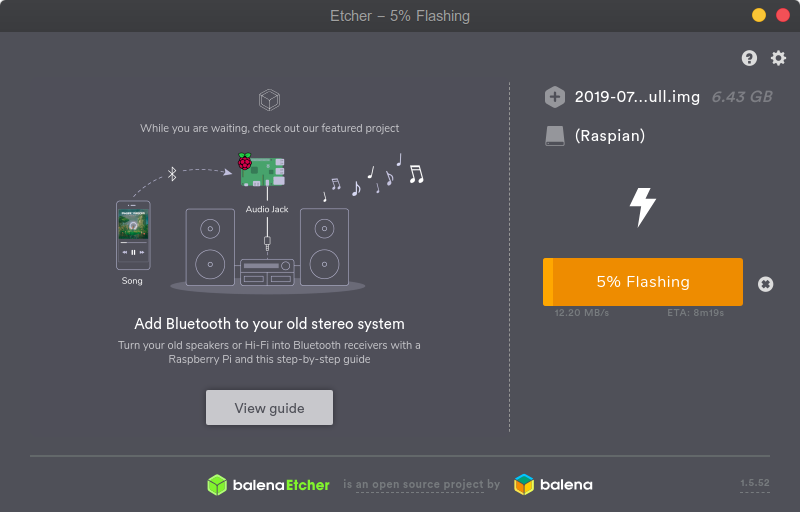
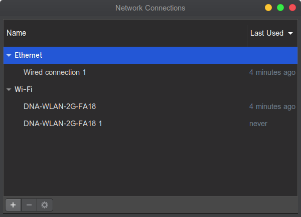
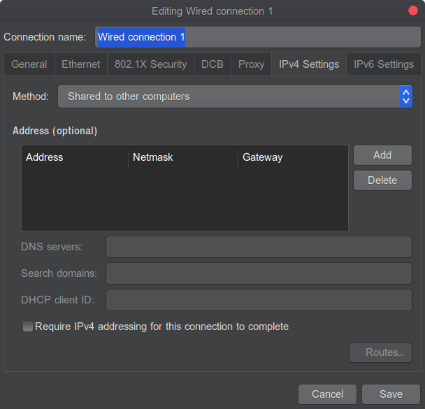
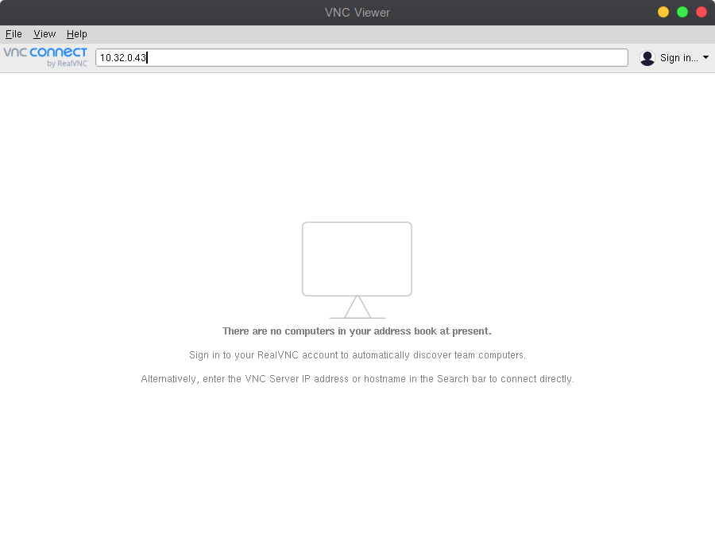
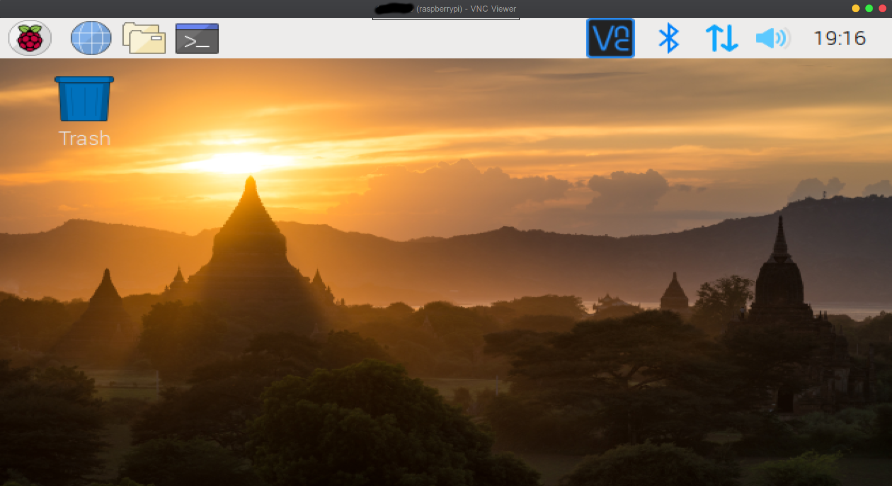

# Setting up Raspberry Pi (Connecting direct from laptop via Ethernet) - Headless Installation


## Flashing Raspberry Pi
* First you need a micro sd card of minimum 8Gb space,with FAT format.
* Then you need a software to flash to the sd. In our case its https://www.balena.io/etcher/. Download the current platform image.
* Now lets download the latest image of raspian from here https://www.raspberrypi.org/downloads/raspbian/. I am using Raspbian Buster with desktop and recommended software.
* Unzip etcher and launch the app.
* Select the downloaded raspian zip file. Etcher shold select correct sd card, if not then select that. Then click Flash. You should see the following screen



* In my case I would like to have ssh to be enabled, so to do that you can create a ssh file in the sd card's boot partition. the file content does not matter just the file name ssh is enough. https://www.raspberrypi.org/documentation/remote-access/ssh/

* Unmount the sd card and pop it in the raspberrypi.

## Connecting to Raspberry Pi
* Now, these steps are important if you would like to avoid the hassle of having another monitor, keyboard, mouse to connect to the raspberrypi. 
* Instead we will connect it just from the PC or laptop in my case, just by using the ethernet cable. 
> Note: I am using Ubuntu and I will explain how to do it on ubuntu.
* First install the following tools net-tools and nmap.

```bash
sudo apt-get install net-tools
```

```bash
sudo apt-get install nmap
```
* Now edit your enthernet to be shared with other computers.

```bash
nm-connection-editor
```



* select the ethernet connection and click on the settings button at the bottom of the window.
* select the IPv4 tab and set Method to be "Shared to other computers"
 


* Press Save and reboot
* Now connect your raspberrypi with an ethernet cable and other end connect it directly to your laptop.
* run the following command to know your ethernet cnonnection name.

```bash
ifconfig
``` 

* It will list you all connections configured. And find the ethernet connection name, in my* case its *eno1*
* In the information of that ethernet search for the text Broadcast and the following ip text.
* You can also use the following command

```bash
ifconfig eno1 | grep "broadcast" | awk -F: '{print $1}' | awk '{print $6}'
```

* In my case it was ***10.32.0.255***
* Now, lets find the ip of the raspberrypi to connect to (remember that its connected to your laptop via ethernet)
* Run the following command

```bash
nmap -n -sP 10.32.0.255/24
```

* It should return something like this

```
Starting Nmap 7.60 ( https://nmap.org ) at 2019-07-26 15:43 EEST
Nmap scan report for 10.32.0.1
Host is up (0.00031s latency).
Nmap scan report for 10.32.0.43
Host is up (0.0014s latency).
Nmap done: 256 IP addresses (2 hosts up) scanned in 2.81 seconds
```

* The last ip is your raspberrypi ip.
* Lets use ssh to connect to it.
```bash
ssh -Y pi@10.32.0.43
```

* What we are doing is that we are trying to login with user *pi*
* Now it wil ask for password. Give ***raspberry***. That is the default password.
* If everything is fine you shoudl see this 
* pi@raspberrypi:~ $ 
* Now lets enable the possibily to see the raspian os ui from our laptop
* First lets enable VNC server 
* You can read more here : https://www.realvnc.com/en/connect/docs/raspberry-pi.html#raspberry-pi-setup
* Run the following command

```bash 
sudo apt-get update
```

```bash
sudo apt-get install realvnc-vnc-server
```

* Now lets make the service to be started at bootup

```bash
sudo systemctl enable vncserver-x11-serviced.service
```

* Choose option 1 and give password raspberry
* Now lets start the service 

```bash
sudo systemctl start vncserver-x11-serviced.service
```

* Choose option 1 and give password raspberry
* Now in our laptop we have to install VNC viewer from here https://www.realvnc.com/en/connect/download/viewer/linux/ . Remeber to select DEB x64 if you are on ubuntu like me. Then click on download.
* Install it. And launch it.

  

* Put the IP of the raspberrypi and press enter.
* It will ask for username and password. 
* Username: pi and password: raspberry
* If everything is fine you should see the raspberrypi ui.



* Also, remeber to set the resolution correctly. In your raspberrypi, go to Menu -> Preference -> Raspberry Pi Confirguration.
* Under System tab press button Set resolution and set it accordingly.
* I hope this helps. If you have reached till here and everything works then you have done really good job!